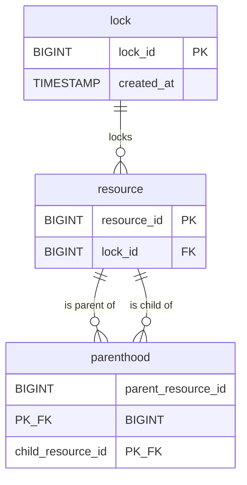

# Database schema

The MySQL-backed engine uses three tables: `lock`, `resource`, and `parenthood`.  
A `resource` may be locker (hold a reference to a `lock` via `lock_id`), and the `parenthood` table stores the parent → child edges of the resource graph.



Descendants are resolved recursively at query time, as follows:
```SQL
WITH RECURSIVE descendants AS (
        SELECT child_resource_id FROM parenthood WHERE parent_resource_id = ?
        UNION
        SELECT p.child_resource_id FROM parenthood p
        JOIN descendants d ON p.parent_resource_id = d.child_resource_id
        ) SELECT child_resource_id FROM descendants
```
The `UNION` (not `UNION ALL`) deduplicates already-visited nodes, so cyclic `parenthood` graphs terminate naturally instead of recursing forever; `cte_max_recursion_depth` (default 1000) is an additional hard safety cap that fails the query fast rather than looping.

# How it works with Galera multi-master

Galera certification is write-set based, keyed by primary key — and lockResource writes to every row it's protecting (`UPDATE resource SET lock_id=… WHERE resource_id IN (entire subtree)`). So the rows we need mutual exclusion on are exactly the rows in our write-set. That's what makes it safe cross-node.

Walking it through:
- Intra-node: `SELECT … FOR UPDATE` serializes transactions on the same node.
- Inter-node: two transactions locking overlapping subtrees both pass the checks on local nodes (`FOR UPDATE` and reads are node-local, so neither sees the other). But at commit, both broadcast write-sets, and those write-sets share rows (the overlap). Certification lets exactly one into the global order; the other fails certification and is rolled back. No double-lock possible — because for both to commit, their write-sets would have to be disjoint, which for overlapping subtrees they aren't. So the correctness in this case comes from write-set overlap.

Every resource that must be mutually excluded has to be in the transaction's write-set. We satisfy this by updating lock_id on the full subtree, not just the root.
If someone ever "optimized" lockResource to only UPDATE the root row and leave descendants' lock_id untouched (tracking the lock elsewhere), Galera would stop catching descendant-level conflicts, because those rows would no longer be in the write-set. The current design is safe precisely because it writes all of them.

Note:
1. The loser gets a deadlock/certification error (1213), not a `LockConflictException`. The outcome is correct (one winner), but across nodes the losing transaction surfaces as a generic rollback rather than the clean domain exception. A retry then re-reads, sees the rows locked, and returns a proper `LockConflictException`. So you likely want deadlock-retry handling around these calls for multi-writer PXC.
2. Replication lag affects efficiency, not correctness. If node B hasn't yet applied node A's just-committed lock, B's `FOR UPDATE` check passes, B does the work, then B loses certification at commit. Wasted effort, but never an incorrect double-lock.

Bottomline:
PXC 9.7 multi-writer is safe for this scheme, given:
- a. you keep updating the whole subtree and  
- b. you add deadlock/certification retry on the caller side.